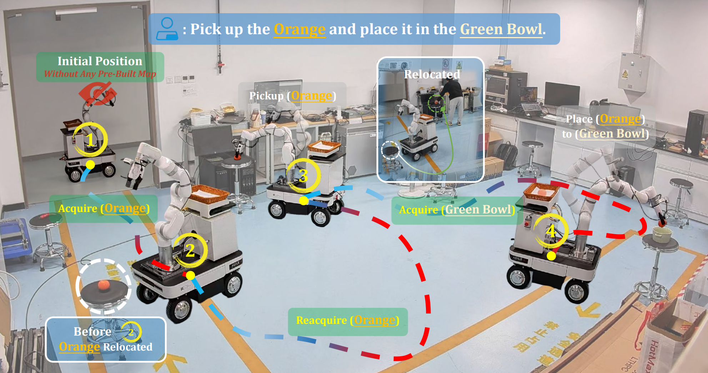

# DREAM: Dynamic Resilient Spatio-Semantic Memory with Hybrid Localization for Mobile Manipulation



## Requirements

- Hardware side: Ubuntu 22.04, ROS2 Humble, CUDA 12.1, system RAM >= 16 GB
- Service machine: Ubuntu 22.04, no ROS distro restriction, CUDA 12.1, at least 24 GB VRAM on one GPU or two GPUs with at least 16 GB VRAM each

## Installation Guides

- Hardware-side installation: [hardware_install.md](docs/hardware_install.md)
- Service-machine installation: [service_machine_install.md](docs/service_machine_install.md)

## Run

### Hardware machine (ROS runtime)

Always source ROS2 + workspace first in each terminal:

```bash
source /opt/ros/humble/setup.bash
source ~/DREAM_ws/DREAM_ws/install/setup.bash
```

```bash
ros2 launch dream_ros2_bridge dream_node_start.launch.py use_rviz:=false
```

Common options:

```bash
ros2 launch dream_ros2_bridge dream_node_start.launch.py use_rviz:=true
ros2 launch dream_ros2_bridge dream_node_start.launch.py use_simple_urdf:=false
ros2 launch dream_ros2_bridge dream_node_start.launch.py robot_ip:=192.168.1.233 joint_states_rate:=50
```


Terminal 2 (RTAB-Map SLAM):

```bash
source /opt/ros/humble/setup.bash
source ~/DREAM_ws/DREAM_ws/install/setup.bash
ros2 launch dream_ros2_bridge dream_rtabmap_slam.launch.py
```

Terminal 3 (DREAM ROS bridge server):

```bash
source /opt/ros/humble/setup.bash
source ~/DREAM_ws/DREAM_ws/install/setup.bash
ros2 launch dream_ros2_bridge dream_server.launch.py
```

### Service machine (AnyGrasp server)

#### Run Anygrasp

If you deploy manipulation service on a separate server, run:

```bash
conda activate anygrasp
cd ~/DREAM_ws/DREAM/src/anygrasp_manipulation
python demo.py --open_communication --port 5557
```

#### Run Dream
```bash
cd ~/path/to/DREAM
python src/dream/app/run_dream.py --robot_ip 10.33.140.5 --server_ip 127.0.0.1  --skip_confirmations
```
If you run anygrasp in other machine, you should change `server_ip`


## Others
TBD