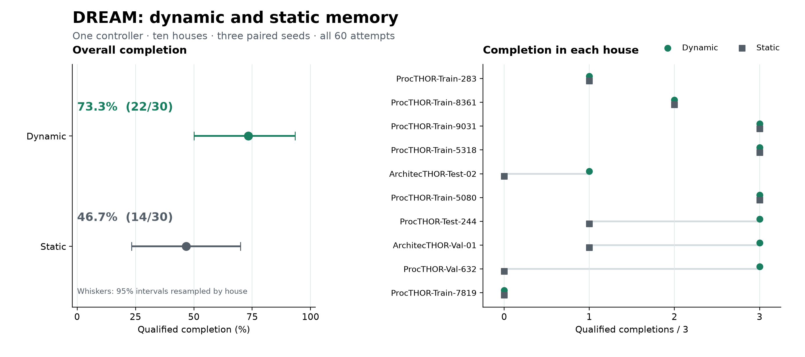

# Common-controller memory comparison

This study runs the recovery_v2 controller in ten houses with three seeds and both dynamic and static memory. All 60 attempts are included. Completion in the table requires passing independent physics replay and record checks, including the native-environment contact check.

| Memory | Qualified / attempts | Completion | 95% house interval |
| --- | ---: | ---: | ---: |
| Dynamic | 22/30 | 73.3% | [50.0%, 93.3%] |
| Static | 14/30 | 46.7% | [23.3%, 70.0%] |



[PDF figure](analysis/memory_comparison.pdf) · [SVG figure](analysis/memory_comparison.svg) · [Figure caption](analysis/figure_caption.md)

Dynamic minus static completion is +26.7 percentage points, with a 95% interval of [+6.7, +50.0]. Intervals use 20,000 house-level bootstrap draws, preserving paired seeds and variants.

Results cover ten development houses. Controller selection used nine dynamic-memory tasks from these houses; the final comparison runs the selected controller on all 60 declared attempts.

The [controller selection record](analysis/development.json) lists the common nine-task development subset and every evaluated candidate. `development_records.zip` preserves their frozen controller sources, protocols, outcomes, audit status, and recording checksums.

The [analysis](analysis/comparison_analysis.json) includes every outcome and a matched comparison with the [previous recovery controller](../recovery-study/README.md). The input comparison identifies the changed controller modules and verifies that task definitions and room maps are unchanged.

`protocol_and_inputs.zip` contains the frozen source, task inputs, and batch records. The 60 archives in `attempts/` contain compact execution records; `audit_reports.zip` contains replay and record-check reports. Extract these archives into one directory to obtain the layout accepted by `python -m dream_sim.study_report`.

For example, with the records extracted into `results/recovery_v2_records`, run this command from the repository root to reproduce the statistics and previous-controller comparison:

```bash
python -m dream_sim.study_report --run results/recovery_v2_records \
  --audits results/recovery_v2_records/audits \
  --baseline-csv reproducibility/evidence/recovery-study/analysis/attempts.csv \
  --include-contact-rejections --output results/recovery_v2_summary
```

RGB-D recordings and videos are retained in the complete local archives, identified by each attempt's `recording_archive.json`; those larger files are not included here. `manifest.json` lists checksums for every packaged file and archive member.

See the [reproduction guide](../../../docs/reproduction.md#evaluate-a-common-controller) to execute the controller or recompute the statistics.
